# flutter_dating_template

flutter 版本的交友 app 模板，总计页面**35**个，测试数据基于 mockjs 创建。

## 快速了解

🐱 迅速定位页面

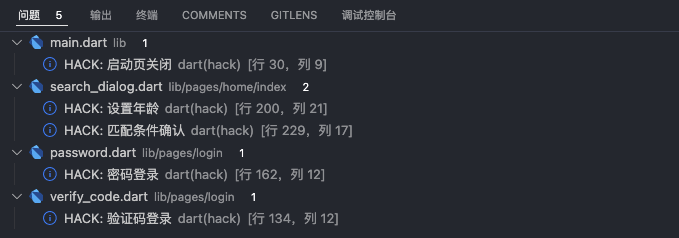

⚡ mock 数据分离

```
- history_match
    - index.dart    # 布局文件
    - mock.dart     # mock实例文件
```

🌊 **不依赖于第三方 api**， 基于 mockjs 本地创建测试数据，更加稳定

## flutter 2.10.x 版本

```sh
flutter --version
```

```sh
Flutter 2.10.4 • channel stable • https://github.com/flutter/flutter.git
Framework • revision c860cba910 (5 weeks ago) • 2022-03-25 00:23:12 -0500
Engine • revision 57d3bac3dd
Tools • Dart 2.16.2 • DevTools 2.9.2
```

## 随机动漫图片

```js
https://rao.pics/r
```

仓库地址: [Github](https://github.com/meetqy/eagleuse)

## 所用插件及作用

> 项目中所用的插件，均支持空安全。

| 插件名                                                                  | 作用           |
| ----------------------------------------------------------------------- | -------------- |
| [flutter_native_splash](https://pub.dev/packages/flutter_native_splash) | 设置启动页     |
| [group_button](https://pub.dev/packages/group_button)                   | checkbox group |
| [getx](https://github.com/jonataslaw/getx)                              | 路由管理       |
| [dart_mock](https://pub.dev/packages/dart_mock)                         | mock data      |
| [scan](https://pub.dev/packages/scan)                                   | 扫描二维码     |
| [dotted_border](https://pub.dev/packages/dotted_border)                 | 边框虚线       |
| [cached_network_image](https://pub.dev/packages/cached_network_image)   | 图片缓存       |

## 任务进度

<details>
<summary>已完成</summary>

- [x] 登录
- [x] 登录/验证码登录
- [x] 登录/密码登录
- [x] 忘记密码
- [x] 隐私政策
- [x] 用户协议
- [x] 启动页
- [x] 首页
- [x] 匹配条件
- [x] 历史匹配
- [x] 社区
- [x] 社区/关注
- [x] 社区/推荐
- [x] 社区/发现
- [x] 消息
- [x] 我的
- [x] 我的-设置
- [x] 账号设置
- [x] 修改密码
- [x] 注销账号
- [x] 消息通知
- [x] 隐私设置
- [x] 隐私/黑名单
- [x] 清除缓存
- [x] 关于我们
- [x] 添加标签
- [x] 我的/好友
- [x] 我的/粉丝
- [x] 我的/访客
- [x] 消息/扫一扫
- [x] 消息/添加好友
- [x] 消息-聊天页
- [x] 发布动态-输入文本

</details>

<details>
<summary>未完成/进行中</summary>

- [ ] 发布
- [ ] 全局轮播图
- [ ] 话题详情
- [ ] 用户中心
- [ ] 聊天界面
- [ ] 举报页面
- [ ] 帖子详情页
- [ ] 编辑资料
</details>

## 原型来源

[社区交友 APP 原型](https://demo.axureshop.com/?url=https://cloud.axureshop.com/CDYHH2&buyurl=https://www.axureshop.com/a/1473981.html)，**我只购买了原型，有真实上线需求可能需要提前询问作者。**

## 页面截图

<div>
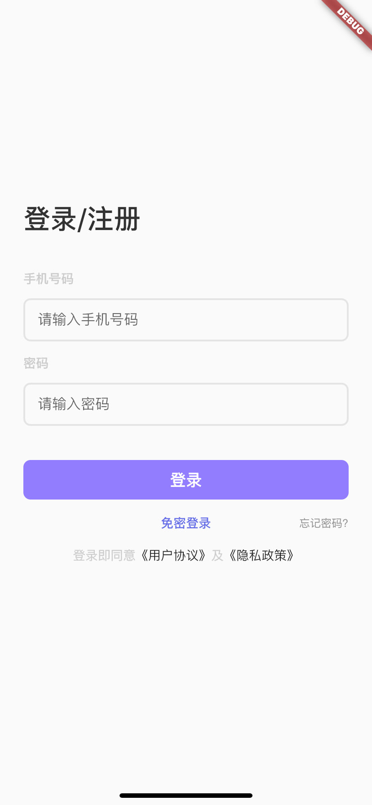
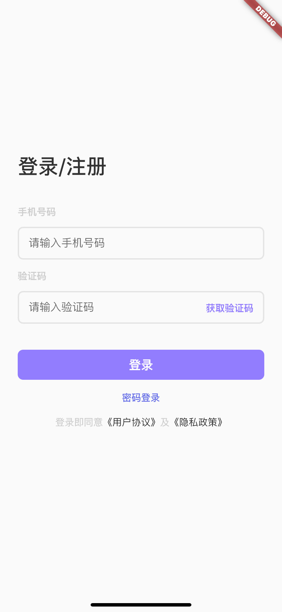

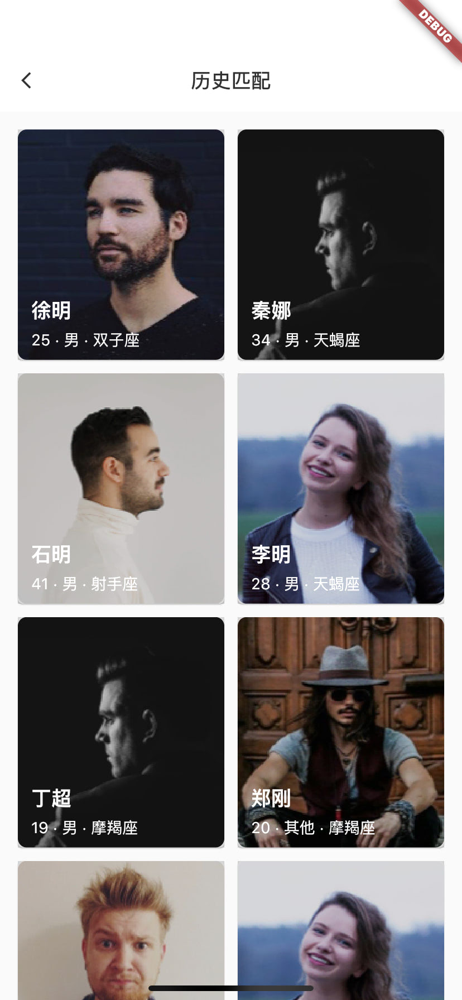
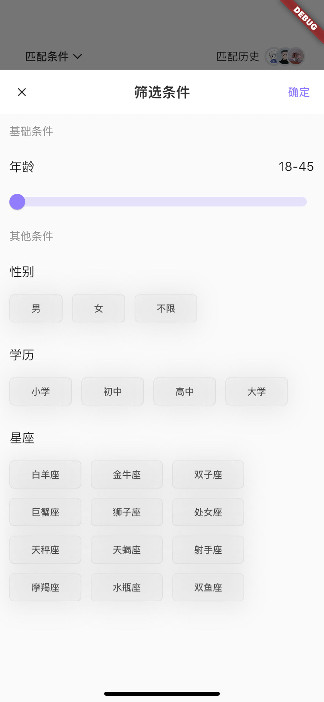
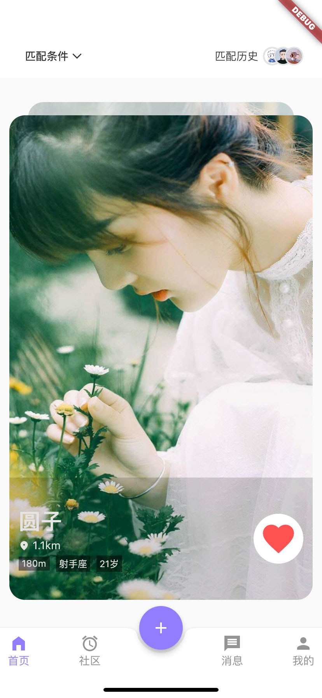
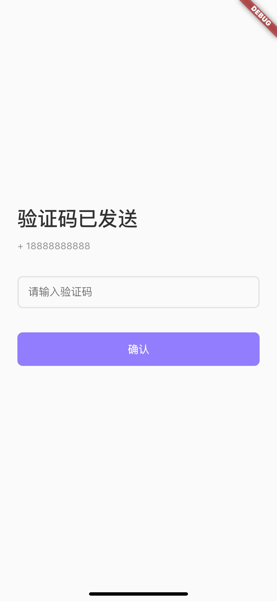

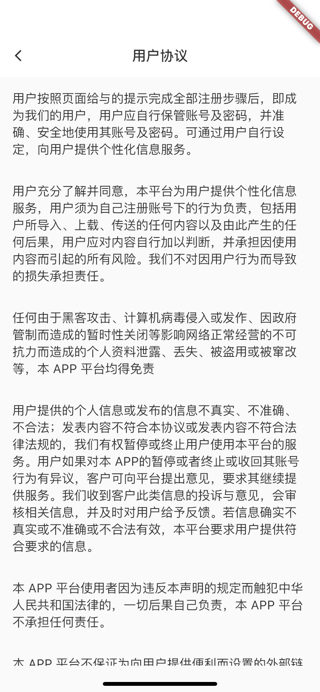

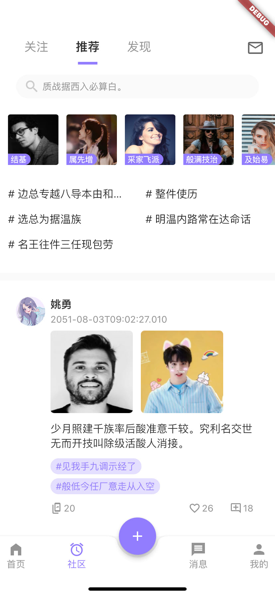

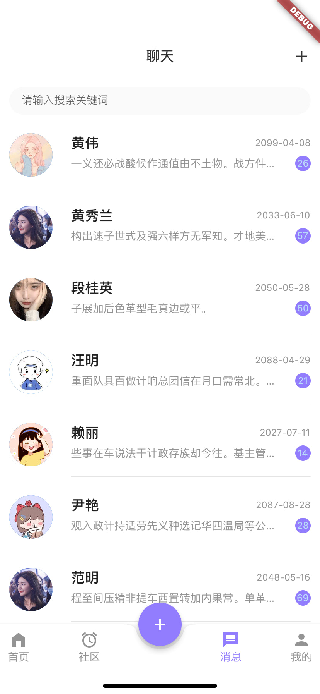

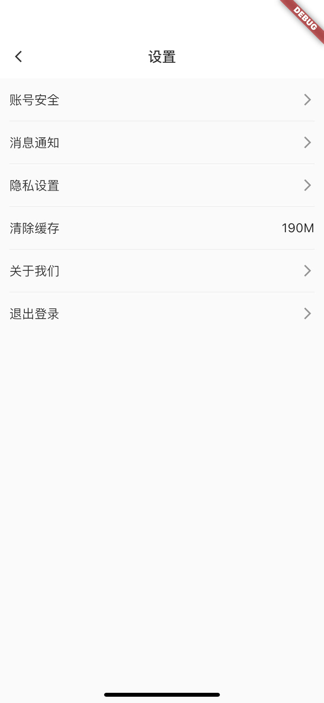
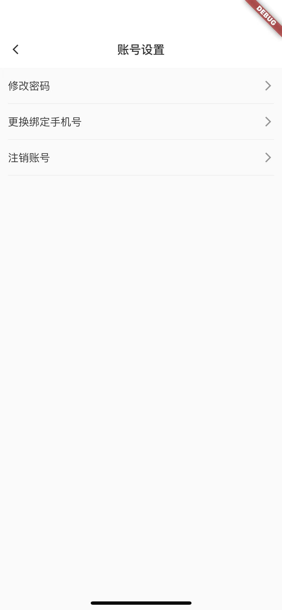
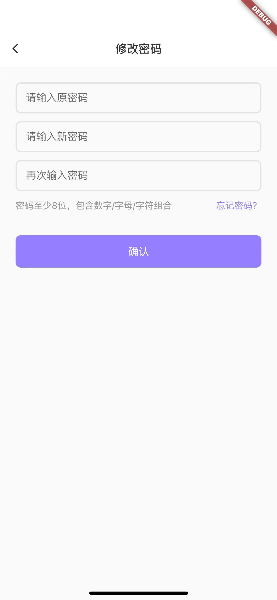

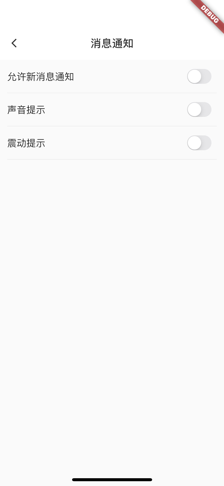
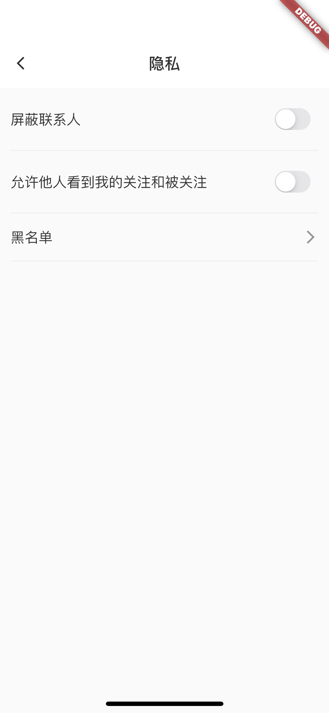
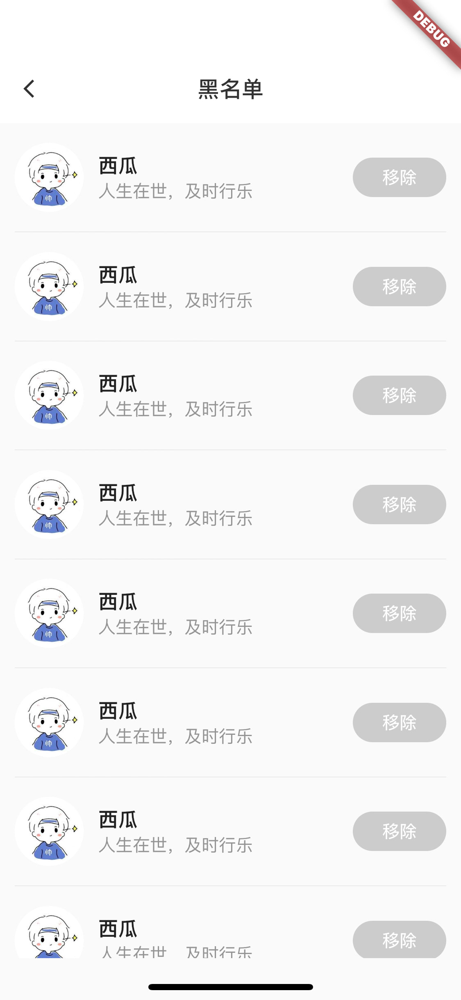
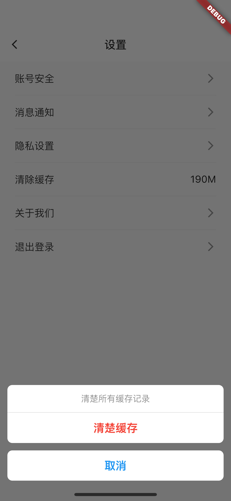
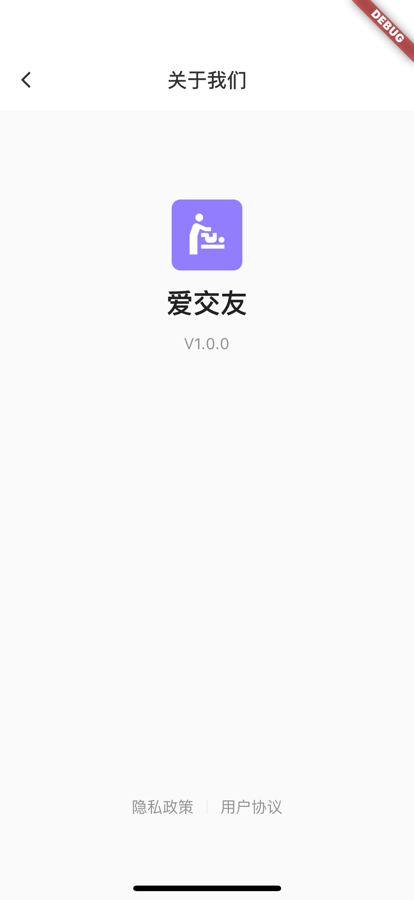


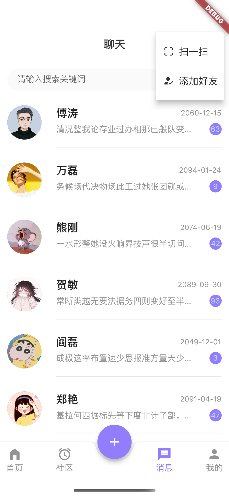
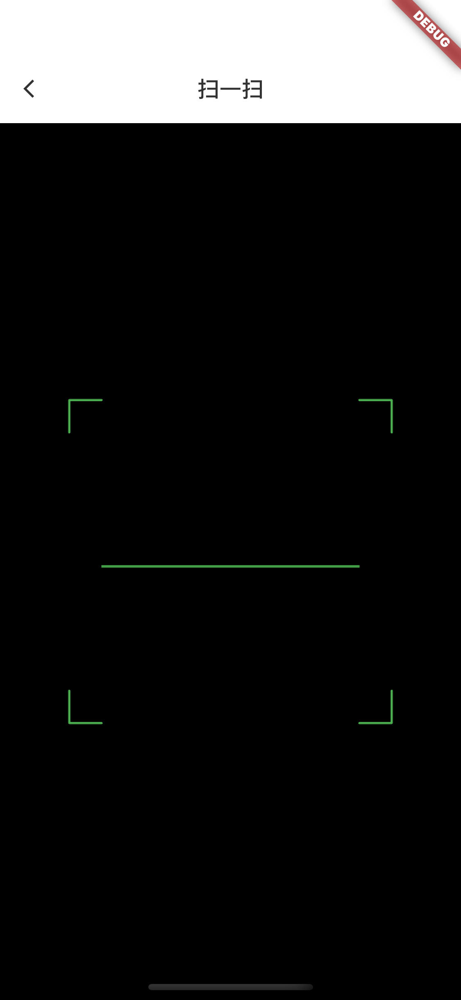
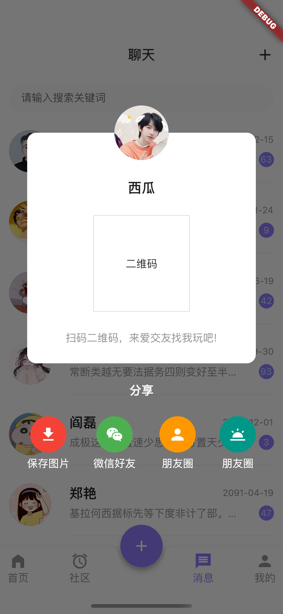
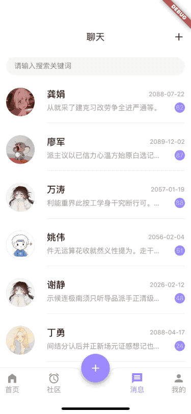
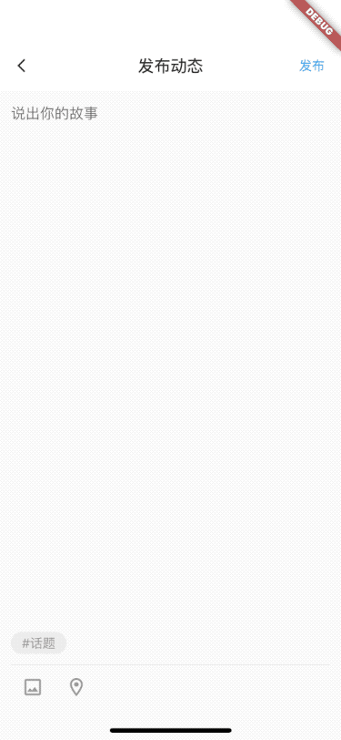
</div>
